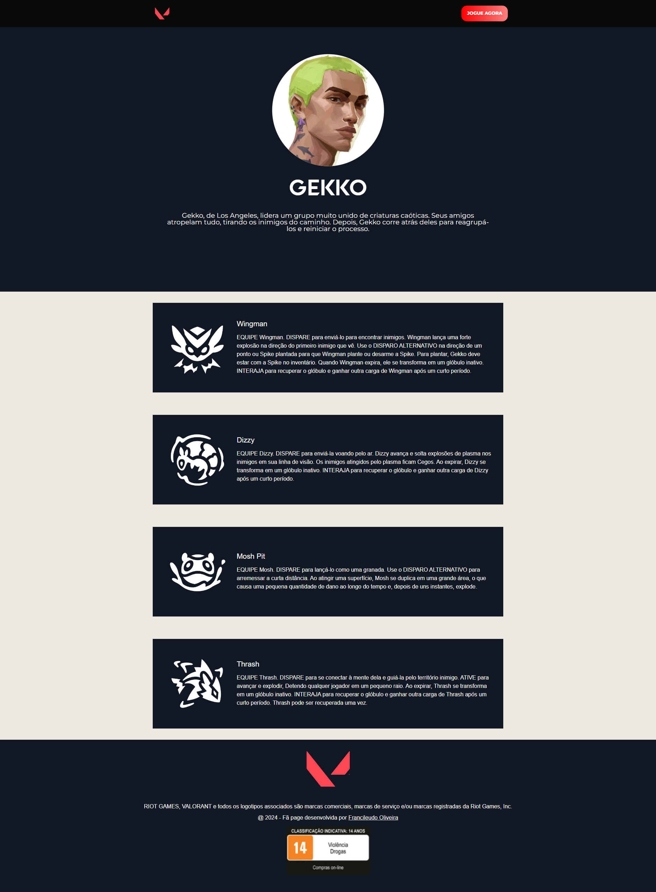

<div align='center' id='top'>


&#xa0;

<a href='https://valorant-page-eta.vercel.app'>Demo</a>

</div>

<h1 align='center'>Valorant - Fã Page</h1>

<p align='center'>


<!--  -->

<!--  -->

<!--  -->
</p>

<p align='center'>
<a href='#dart-sobre'>Sobre</a> &#xa0; | &#xa0;
<a href='#sparkles-funcionalidades'>Funcionalidades</a> &#xa0; | &#xa0;
<a href='#rocket-tecnologias'>Tecnologias</a> &#xa0; | &#xa0;
<a href='#white_check_mark-pré-requesitos'>Pré requisitos</a> &#xa0; | &#xa0;
<a href='#checkered_flag-começando'>Começando</a> &#xa0; | &#xa0;
<a href='#memo-licença'>Licença</a> &#xa0; | &#xa0;
<a href='https://github.com/fransilva0' target='_blank'>Autor</a> &#xa0; | &#xa0;
</p>

<br>

## :dart: Sobre ##

<p>
  Este repositório armazena uma fã page do jogo Valorant, desenvolvida por Francileudo Oliveira como forma de estudo e aperfeiçoamento em ReactJs. O projeto utiliza-se da api open source da Riot Games, realizando o consumo da mesma para apresentar os dados de agentes e armas do jogo. Cada agente tem sua página de informes apresentando suas habilidades e sua biografia. Futuramente pensa-se em desenvolver páginas para as armas no qual sejam apresentados suas skins disponíveis no jogo. A seguir é apresentado a homepage e a tela de agentes.
</p>


<br />




## :sparkles: Funcionalidades ##

- [X] Apresentação de todos os agentes do jogo
- [X] Apresentação de habilidades de cada agente
- [X] Apresentação de lista de armas do jogo
- [ ] Apresentação de skins de armas do jogo

## :rocket: Tecnologias ##

As seguintes ferramentas foram usadas na construção do projeto:

- [React](https://pt-br.reactjs.org/)
- [Styled-Components](https://styled-components.com/)

## :white_check_mark: Pré requisitos ##

Antes de começar :checkered_flag:, você precisa ter o [Git](https://git-scm.com) e o [Node](https://nodejs.org/en/) instalados em sua maquina.

## :checkered_flag: Começando ##

```bash
# Clone este repositório
$ git clone https://github.com/fransilva0/valorant-page.git

# Entre na pasta
$ cd valorant-page

# Instale as dependências
$ npm install

# Para iniciar o projeto
$ npm start

# O app vai inicializar em <http://localhost:3000>
```

## :memo: Licença ##

Este projeto está sob licença MIT. Veja o arquivo [LICENSE](LICENSE.md) para mais detalhes.


Feito com :heart: por <a href='https://github.com/fransilva0' target='_blank'>Francileudo Oliveira</a>

&#xa0;

